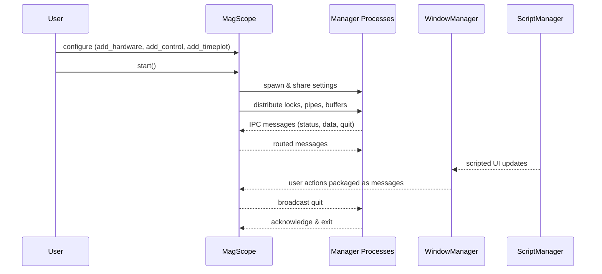

# MagScope Orchestrator

The `magscope.scope` module defines the :class:`MagScope` façade that ties every
subsystem together. When you call `MagScope.start()` the class performs three
overarching jobs:

1. **Gather the managers** – built-in managers (camera, bead lock, video
   processor, script, and window) plus any hardware added through
   `MagScope.add_hardware()` are collected in a registry so they can be started
   and supervised as a unit.
2. **Prepare shared resources** – configuration is loaded from YAML, shared
   memory buffers are constructed for video frames and bead telemetry, and each
   process receives locks, pipes, and quitting events to coordinate IPC.
3. **Relay messages** – the main loop polls every pipe for
   `magscope.utils.Message` instances and forwards them to the appropriate
   process. A `quit` message triggers a graceful shutdown sequence that joins
   every child process.



## Usage example

```python
from magscope.scope import MagScope
from myhardware.stage import StageManager
from myui.panels import StagePanel

scope = MagScope()
scope.add_hardware(StageManager())
scope.add_control(StagePanel, column=1)

try:
    scope.start()
finally:
    print("Scope exited cleanly")
```

For scripts that run unattended you can also call `scope.add_timeplot(plot)` to
queue a custom time-series view before the GUI boots. Each of these helpers only
collects configuration; the actual Qt widgets and multiprocessing targets are
instantiated inside `MagScope.start()` so they remain synchronized.
