.. _user_guide:

User Guide
==========

This guide walks through MagScope from the point of view of a new user at the
graphical interface. It starts with the simulated-camera demo, then explains the
same controls you will use during real microscope acquisition.

If MagScope is not installed yet, start with :doc:`getting_started`. If you are
connecting a lab camera or hardware manager, keep :doc:`connect_camera` and
:doc:`connect_hardware` nearby, but use this page first to learn the interface.

What This Guide Covers
----------------------

The sections follow a normal first session:

* Launch the demo.
* Identify the main window areas.
* Add and manage bead ROIs.
* Start acquisition and understand what is being processed.
* Record a short first dataset and check the saved files.
* Choose what data to save and where it should go.
* Read live plots and analysis panels.
* Edit preferences and layout.
* Use locking, scripting, and hardware-aware panels.
* Shut down cleanly and recover from common beginner problems.

The screenshots use MagScope's simulated bead camera. Real cameras and motors
may expose different settings, but the window layout and workflow concepts are
the same.

Launch the Demo
---------------

MagScope includes a simulated camera, so you can open the full GUI without
microscope hardware. From a Python interpreter in the environment where
MagScope is installed, run:

.. code-block:: python

   import magscope

   scope = magscope.MagScope()
   scope.start()

The call to ``start()`` opens the GUI and starts the MagScope manager
processes. In the default demo, the simulated camera begins producing bead
images immediately.

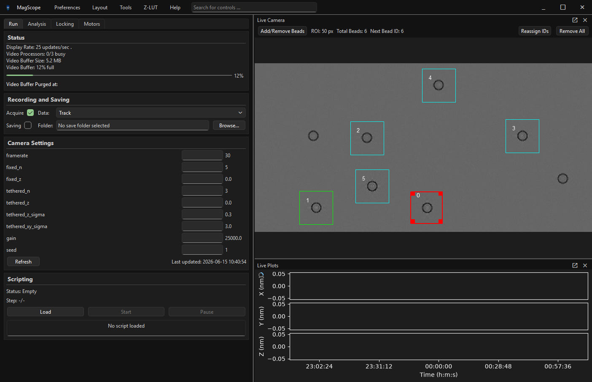

Important lifecycle rule: a ``MagScope`` instance can only be started once. If
you close MagScope and want to launch it again from the same Python session,
create a new ``MagScope`` object before calling ``start()`` again.

First Look at the Main Window
-----------------------------

The default window has four main areas:

* The top bar, with ``Preferences``, ``Layout``, ``Tools``, ``Z-LUT``, ``Help``,
  and the search box.
* The control tabs on the left: ``Run``, ``Analysis``, ``Locking``, and
  ``Motors``.
* The ``Live Camera`` viewer, which shows the latest camera image and bead ROIs.
* The ``Live Plots`` viewer, which shows tracking values once data reaches the
  plot buffer.

The control tabs keep related panels together. You do not need to understand
every panel before using MagScope. For a first session, start with the ``Run``
tab, then move to ``Analysis`` once bead tracking data is available.

Run Tab
^^^^^^^

The ``Run`` tab contains the panels most users check first: status, recording
and saving, camera settings, and scripting.

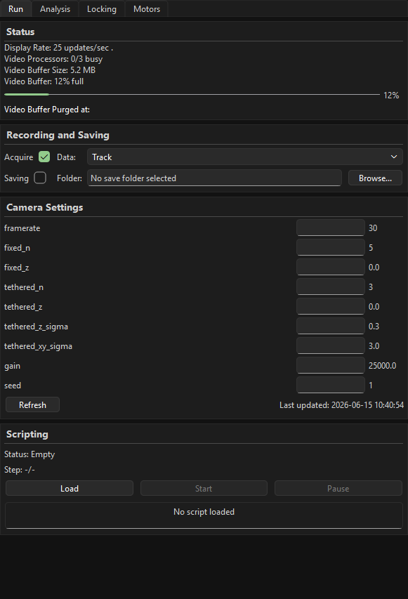

Use this tab to answer practical acquisition questions:

* Is the GUI updating?
* Are video processors keeping up?
* Is frame processing enabled?
* Is data saving enabled?
* Which camera settings are currently exposed?
* Is a script loaded or running?

Analysis Tab
^^^^^^^^^^^^

The ``Analysis`` tab contains plot settings and live diagnostic panels.

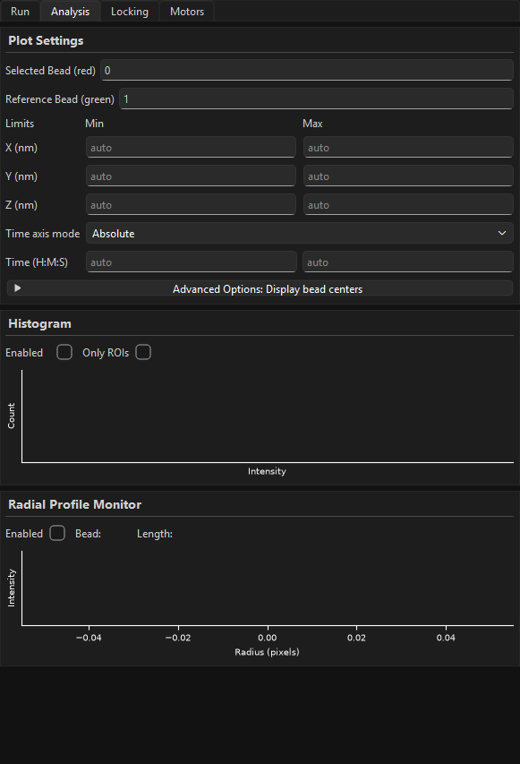

Use this tab when you want to choose a plotted bead, subtract a reference bead,
adjust plot limits, or temporarily enable diagnostic views such as the histogram
or radial profile monitor.

Locking Tab
^^^^^^^^^^^

The ``Locking`` tab contains XY and Z feedback controls.

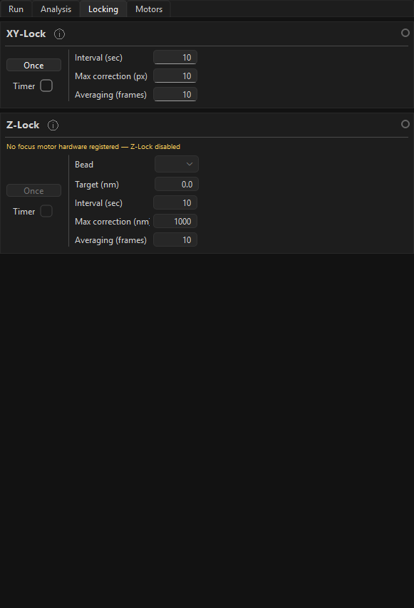

These controls are useful after ROIs, tracking, and hardware connections are
working. New users should first learn acquisition and plots before enabling
automatic corrections.

Motors Tab
^^^^^^^^^^

The ``Motors`` tab is populated by registered hardware managers. In the demo,
no user hardware managers are registered, so MagScope shows a placeholder.

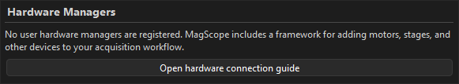

When hardware managers are present, this tab is where their user-facing control
panels appear. The exact controls depend on the manager: a focus motor might
show position, target, and speed controls, while a stage, light source, or other
device could expose different fields. Treat the tab as the operator surface for
hardware that was registered before MagScope started.

Before relying on a hardware panel during acquisition:

* Confirm the expected device panel appears in ``Motors``.
* Confirm the displayed units and limits match the physical instrument.
* Confirm the values update while the device is connected or moving.
* Practice with conservative movements before combining hardware motion with
  saving, scripts, or lock controls.

When you are ready to add motors, stages, lights, or other devices to a custom
launch script, see :doc:`connect_hardware`.

Work With Panels and Search
---------------------------

The left side is organized into workflow tabs, and each tab contains titled
panels. If a tab has more controls than fit on screen, scroll the controls area
to reach the lower panels.

Use the search box in the top bar when you know the name of a setting but not
where it lives. For example, searching for ``ROI`` points you toward ROI-related
controls and settings.

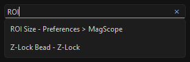

Search helps you find controls. It does not start acquisition, change settings,
or save data by itself. You still need to inspect and confirm the highlighted
control.

Live Camera and Bead ROIs
-------------------------

The ``Live Camera`` viewer shows the most recent image from the camera. In the
demo, this image is generated by the simulated bead camera.

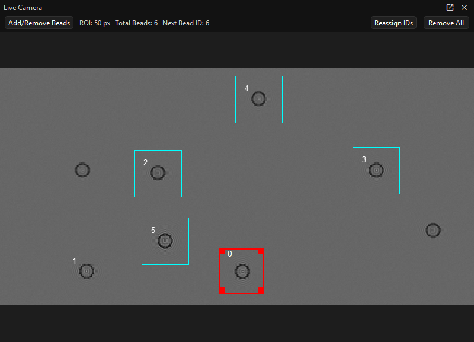

A bead ROI is the square region MagScope uses to crop around one bead before
tracking it. Each ROI has an integer ID. The same ID is used in plot settings,
track data, lock settings, and some scripts.

ROI colors indicate state:

* Cyan ROIs are ordinary tracked beads.
* Red is the selected bead for plotting and profile monitoring.
* Green is the reference bead used for relative plots.

Live Camera Navigation
^^^^^^^^^^^^^^^^^^^^^^

Use the mouse wheel over the ``Live Camera`` image to zoom in and out. The
viewer zooms around the cursor position, so put the cursor near the bead or ROI
you want to inspect before scrolling.

When the image is zoomed in, a minimap appears in the upper-right corner of the
viewer. The minimap shows the full camera image, a red rectangle for the part
currently visible, the zoom level, and a ``Reset`` button. Click ``Reset`` to
return to the fit-to-window view.

To move around a zoomed image, drag the image background. If you drag an active
ROI instead, MagScope moves that ROI. If you meant to pan but moved an ROI,
drag the ROI back onto the bead or remove it and add it again.

Zooming changes only the view. It does not change the camera image, saved data,
ROI size, bead IDs, or tracking calculations. Clicks and drags still apply to
the underlying image coordinates. This means you can zoom in for precise ROI
placement, pan to another bead, and keep adding or moving ROIs at the same
camera-pixel ROI size.

Bead Toolbar
^^^^^^^^^^^^

The toolbar above the camera is the quickest place to check and manage the
current ROI set:

* ``Add/Remove Beads`` opens a short reminder of the click actions for adding,
  selecting, moving, and removing bead ROIs.
* ``ROI: <size> px`` shows the current square ROI size in camera pixels. Change
  this in ``Preferences`` before adding a new batch of beads.
* ``Total Beads`` shows how many ROIs are currently active.
* ``Next Bead ID`` shows the ID that will be assigned to the next new bead.
* ``Reassign IDs`` renumbers the current ROIs from ``0`` upward. Use it when
  removed beads have left gaps in the ID sequence and you want a compact set of
  IDs before recording.
* ``Remove All`` clears every bead ROI and resets the next ID to ``0``. Use it
  only when you want to rebuild the ROI list.

``Reassign IDs`` changes the IDs used by plot settings, lock settings, saved
track rows, and scripts. Check selected/reference bead settings after
renumbering. ``Remove All`` also clears the current selection/reference state,
so add or select beads again before tracking or locking.

Manual ROI Workflow
^^^^^^^^^^^^^^^^^^^

For a basic manual workflow:

1. Use the ``Live Camera`` viewer to identify beads.
2. Left-click the image near a bead to add an ROI.
3. Left-click an existing ROI to make it active and selected.
4. Drag the active ROI if it needs to be repositioned.
5. Right-click an ROI to remove it.
6. Use ``Reassign IDs`` if the IDs have gaps and you want them renumbered.
7. Use ``Remove All`` only when you want to clear the current ROI set.

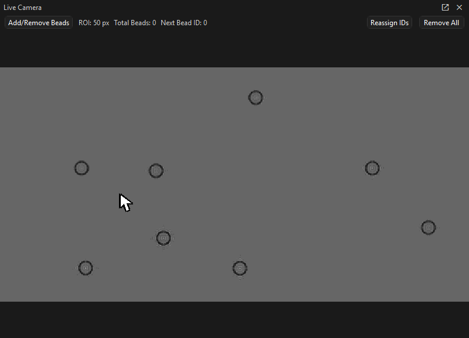

If you click a bead but no ROI appears, check that the click landed inside the
camera image and that the view is not still busy updating. If the ROI appears in
the wrong place, drag it to the bead center or remove it and add it again.
Near the image edge, MagScope keeps the ROI inside the camera image, so the box
may be shifted away from the exact click position.

Auto Bead Selection
^^^^^^^^^^^^^^^^^^^

For images with many similar beads, use ``Tools`` > ``Auto Bead Selection`` to
start from one seed bead and let MagScope propose matching ROIs.

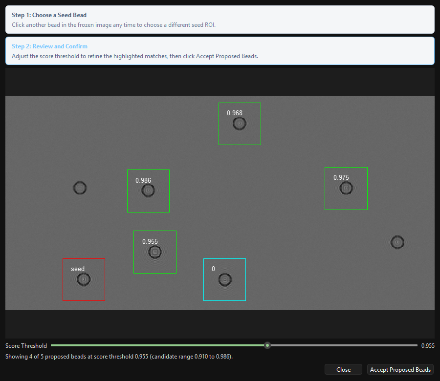

The dialog freezes the current image, marks the seed bead, and highlights
proposed matches with score labels. Move the ``Score Threshold`` slider to show
fewer or more proposed beads. Click ``Accept Proposed Beads`` only after the
highlighted ROIs match the beads you want to track.

After accepting the proposal, the new ROIs appear in the ``Live Camera`` view
with normal bead IDs.

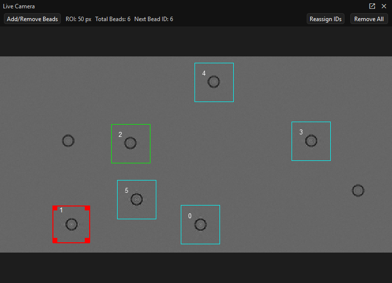

Acquisition Basics
------------------

MagScope separates acquisition into two related actions:

* Processing frames, controlled by ``Acquire``.
* Writing data to disk, controlled by ``Saving``.

Processing can be on while saving is off. This is useful when you are setting up
ROIs, checking tracking quality, or adjusting plots before recording data. Saving
should be enabled only after the output folder and data mode are correct.

The usual beginner workflow is:

1. Launch MagScope.
2. Confirm the live camera is updating.
3. Add or check bead ROIs.
4. Leave ``Acquire`` enabled so frames are processed.
5. Watch the status panel and live plots.
6. Choose a save folder.
7. Choose a data mode.
8. Enable ``Saving`` when you are ready to record.
9. Disable ``Saving`` before changing folders or ending the run.

First Recording Walkthrough
---------------------------

Use this checklist the first time you want to make a small recording. It keeps
setup, tracking, saving, and file checking in one sequence.

1. Launch MagScope.

   Start the demo or your configured microscope setup as described in
   `Launch the Demo`_. Wait for the main window to appear and confirm the
   ``Live Camera`` image is updating.

2. Add and select bead ROIs.

   In the ``Live Camera`` viewer, add one or more bead ROIs manually or with
   ``Tools`` > ``Auto Bead Selection``. Click the bead you want to inspect so
   it becomes the selected bead. The selected bead is the one used by several
   plot, profile, and lock controls.

3. Wait for tracking and plots.

   Keep ``Acquire`` enabled in ``Recording and Saving``. Watch the ``Status``
   panel and ``Live Plots`` view until the display is updating and the selected
   bead has visible tracking data. If the plots are empty, confirm at least one
   ROI exists and that ``Acquire`` is checked.

4. Choose a save folder.

   In ``Recording and Saving``, click ``Browse...`` beside ``Folder`` and pick
   a writable experiment folder. Do this before enabling ``Saving``. Avoid
   changing the folder while saving is active.

5. Pick a data mode.

   For a first recording, choose ``Track`` unless you specifically need video.
   ``Track`` writes bead-position text files and is usually the smallest, safest
   output. Use ``Track and Video (ROIs)`` when you also want cropped ROI video.
   Use full-frame video modes only when you need the entire camera frame.

6. Enable saving.

   Check ``Saving``. Leave ``Acquire`` checked. Let the recording run long
   enough for at least one processing stack to complete. During this time the
   ``Recording and Saving`` panel is highlighted, which is a useful reminder
   that data is being written to disk.

7. Stop saving.

   Uncheck ``Saving`` before changing folders, changing data modes, closing
   MagScope, or ending the experiment. You can leave ``Acquire`` on if you want
   to keep watching the live camera and plots without writing more files.

8. Check the created files.

   Open the folder you selected and look for timestamped output files:

   * ``Bead Positions <timestamp>.txt`` appears for ``Track``,
     ``Track and Video (ROIs)``, and ``Track and Video (Full)``.
   * ``Video <timestamp>.tiff`` appears for the video data modes.
   * ``Bead Profiles <timestamp>.txt`` appears when profile saving is enabled.
   * Hardware managers can also append telemetry to ``<HardwareManagerName>.txt``
     while saving is enabled.

   MagScope writes data in processing batches, so a short recording can create
   several timestamped files instead of one large file. If no files appear,
   check that the folder is writable, ``Saving`` was enabled, the selected data
   mode includes the output you expected, and enough time passed for frames to
   be processed.

Recording and Saving Data
-------------------------

The ``Recording and Saving`` panel is the main place to control processing and
output.

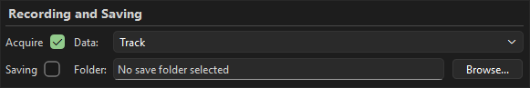

The controls are:

* ``Acquire`` enables frame processing.
* ``Saving`` enables writing selected output data to disk.
* ``Folder`` is the destination for saved data.
* ``Data`` chooses the output mode.

Choose the folder before enabling saving. A saving-ready state has both
``Acquire`` and ``Saving`` checked and a real folder selected.

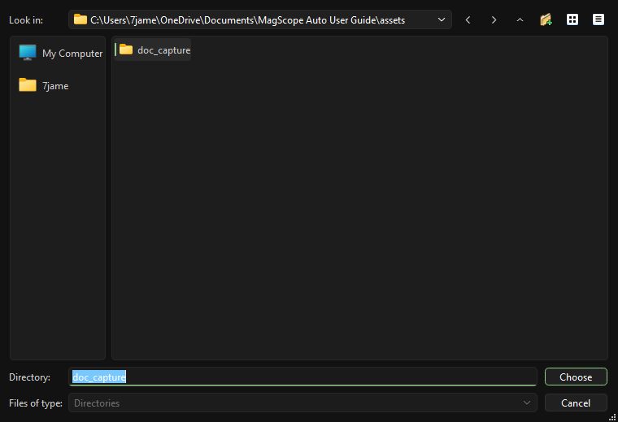

The exact folder picker can look different depending on your operating system.
The important step is to choose a writable experiment folder before turning on
``Saving``.

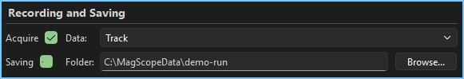

Data Modes
^^^^^^^^^^

The available data modes are:

* ``Track`` saves bead tracking results. This is the best default for most
  magnetic-tweezers experiments.
* ``Track and Video (ROIs)`` saves tracking results and cropped ROI video.
* ``Track and Video (Full)`` saves tracking results and full-frame video.
* ``Video (ROIs)`` saves cropped ROI video without track output.
* ``Video (Full)`` saves full-frame video without track output.

Tracks are usually much smaller than video and are the main analysis product.
Full-frame video is useful for debugging and record keeping, but it is the
heaviest option. If the video buffer fills, reduce saved video volume, reduce
the number of tracked beads, or review buffer and processor settings.

Status and Camera Settings
--------------------------

Use the ``Status`` panel to check whether the GUI and processing pipeline are
keeping up.

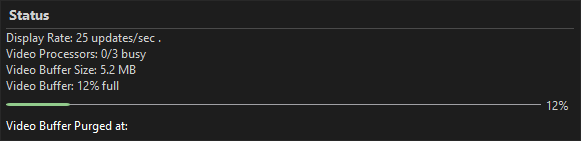

Key status fields:

* ``Display Rate`` is how often the GUI updates the displayed image. It is not
  necessarily the camera frame rate.
* ``Video Processors`` shows how many processing workers are busy.
* ``Video Buffer`` shows how full the shared video buffer is.

The video buffer should normally stay comfortably below full. A full buffer
means frames are arriving faster than they can be processed or saved. That can
lead to old frames being purged before processing.

The ``Camera Settings`` panel shows settings exposed by the active camera.

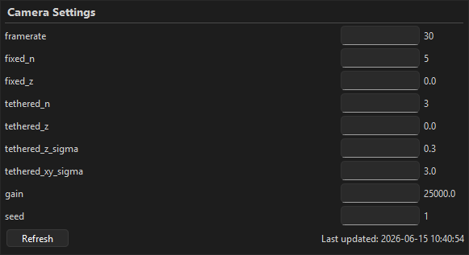

In the demo, these are simulated settings such as frame rate, bead counts, bead
motion, gain, and random seed. With a real camera, the available settings depend
on the camera adapter you provide. See :doc:`connect_camera` for details.

Live Plots and Analysis
-----------------------

The ``Live Plots`` viewer displays bead tracking values and optional hardware
data. At startup, or before track data has reached the plot buffer, it may show
settled axes with no red traces. That is normal. It can take tens of seconds
for the first processed stack to reach the plots and for the axes to settle.

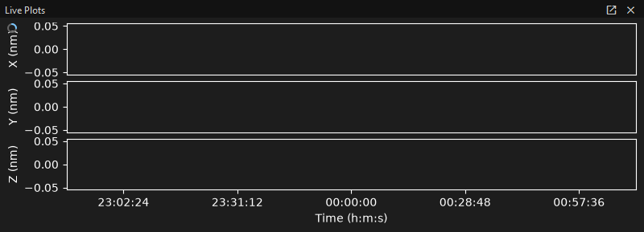

Once tracking data is available, the selected bead's X, Y, and Z values appear
as red traces.

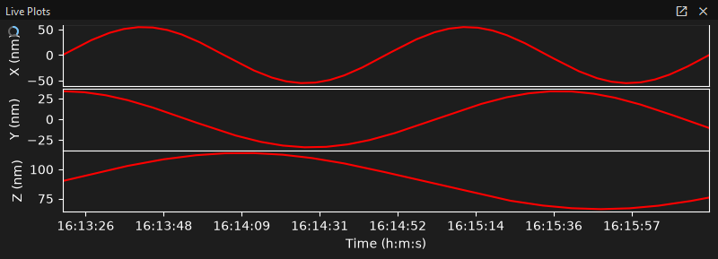

If plots stay blank longer than expected:

* Confirm ``Acquire`` is checked.
* Confirm at least one bead ROI exists.
* Confirm the selected bead ID exists.
* Wait for the processing and plot buffers to update.
* Check the status panel for a full video buffer or busy processors.

Plot Settings
^^^^^^^^^^^^^

The ``Plot Settings`` panel controls what the live plots show. It does not
change tracking, saving, or the data already stored in buffers.

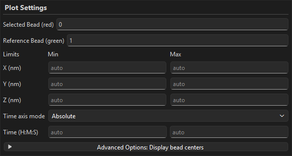

Selected and reference beads
""""""""""""""""""""""""""""

``Selected Bead (red)`` is the bead ID drawn in the live plots. The same
selected bead is also used by diagnostics such as the radial profile monitor.

``Reference Bead (green)`` is optional. Leave it blank for ordinary absolute
selected-bead plots. Enter a bead ID when you want the plot to show selected
bead motion relative to another tracked bead. Referenced plots use only
timepoints where both bead IDs have data. If either bead is missing, or if the
two beads do not share matching timepoints, the referenced plot can be blank or
show fewer points than expected.

For X and Y, the referenced value is selected bead minus reference bead. The Z
plot also follows the Z-LUT convention used by MagScope, so its displayed
relative sign is adjusted for that calibration direction.

Limits and auto-scaling
"""""""""""""""""""""""

The ``Limits`` rows accept optional min and max values for X, Y, Z, and time.
Leave a box blank to let the plot choose that limit automatically. Non-numeric
X/Y/Z values are treated like ``auto``.

Manual X/Y/Z limits are in nanometers. They affect only the live plot display.
They do not delete points, change bead tracking, or change saved
``Bead Positions`` files.

Time axis modes
"""""""""""""""

``Time axis mode`` controls how the horizontal axis is displayed:

* ``Absolute`` shows clock-style time. The time limit boxes accept today-based
  times such as ``14``, ``14:20``, or ``14:20:45``. Dots may also be used as
  separators. Leave the boxes blank for automatic time limits.
* ``Relative`` shows a moving time window ending at the newest plotted data.
  The window box defaults to ``00:05:00``. It accepts ``H``, ``H:M``, or
  ``H:M:S`` values, again with colons or dots. Invalid or non-positive values
  fall back to showing the available plotted range.

Use relative time when you want a stable recent-history view during a long
experiment. Use absolute time when you need to compare plot features to clock
times, saved files, or notes in an experiment log.

What plot settings do not change
""""""""""""""""""""""""""""""""

Changing plot settings changes the live display only. It does not change:

* raw camera frames
* bead ROIs
* tracking calculations
* saved track, profile, video, or hardware files
* the acquisition mode selected in the Recording and Saving panel

Analysis Workflow
^^^^^^^^^^^^^^^^^

The full analysis view brings the selected/reference bead state, live camera,
diagnostic panels, and live plots together.

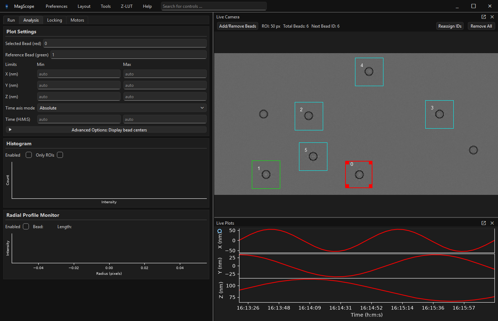

Use this view when you need to verify that the bead IDs in the plot settings
match the highlighted ROIs in the camera view.

Advanced Bead Overlay
^^^^^^^^^^^^^^^^^^^^^

The collapsed ``Advanced Options: Display bead centers`` area in
``Plot Settings`` controls an optional overlay on the live camera.

``Show beads on video? (slow)`` draws recent tracked bead centers on top of the
video image. This can be useful when you want to confirm that tracking results
line up with the visible bead positions, but it adds extra GUI work and can slow
the interface when many beads or many timepoints are drawn.

``Number of timepoints to show`` controls how much recent track history is
drawn. A value of ``1`` shows only the newest center for each bead. Larger
values show more history, which can make drift and motion easier to see but
also increases the overlay cost.

``Marker size`` controls the size of the drawn center markers. Increase it when
markers are hard to see on a high-resolution image. Decrease it when markers
hide the bead, ROI edge, or nearby features.

Use this overlay as a diagnostic check. For routine acquisition, leave it off
unless you are actively comparing tracking output to the live camera image.

Histogram
^^^^^^^^^

The ``Histogram`` panel shows an intensity histogram for the live image. Turn
on ``Enabled`` when you need to check exposure, gain, saturation, or background
levels.

Use ``Only ROIs`` when you want the histogram to describe the current bead ROIs
instead of the whole camera image. This is useful when the full image includes
large background regions that hide the bead intensity distribution.

Keep the histogram disabled unless you need it. It updates live and adds GUI
work during acquisition.

Radial Profile Monitor
^^^^^^^^^^^^^^^^^^^^^^

The ``Radial Profile Monitor`` panel shows a live radial profile for the
selected bead. The panel displays the bead ID and profile length for the
profile currently being shown.

Use this panel while tuning tracking settings, checking bead quality, comparing
profile shape before and after focus changes, or debugging Z-LUT/profile
generation. If the selected bead has no recent profile data, the monitor may
stay blank until acquisition and processing produce one.

Like the histogram, the radial profile monitor is diagnostic. Turn it off during
routine acquisition unless it is needed.

Optional Allan Deviation Panel
^^^^^^^^^^^^^^^^^^^^^^^^^^^^^^

Some MagScope installations show an ``Allan Deviation`` panel in the
``Analysis`` tab. This panel appears only when the optional ``tweezepy`` package
is available. If you do not see it, your installation can still acquire,
track, plot, and save data normally.

Use ``Refresh`` to compute Allan deviation from recent track data.
``History window`` controls how much recent data is used and accepts values like
``30``, ``05:00``, or ``01:00:00``. ``Taus`` chooses the spacing of the tau
values used for the calculation.

The panel uses the current ``Selected Bead (red)`` and, if set, the current
``Reference Bead (green)``. Like the other analysis panels, it is a diagnostic
view. It does not change tracking or saved data.

Preferences and Persistent Settings
-----------------------------------

Open ``Preferences`` from the top bar to edit persistent MagScope settings,
tracking settings, and appearance/layout options.

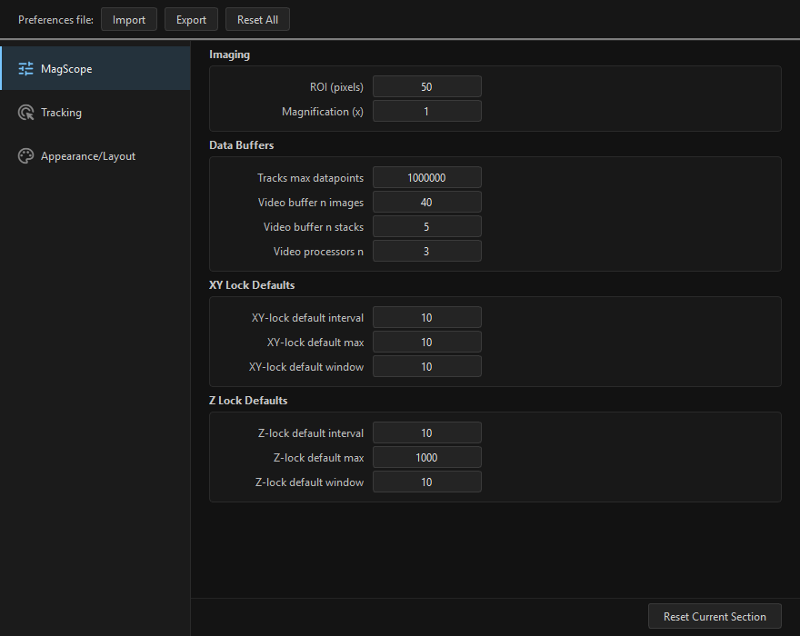

The dialog has three sections:

* ``MagScope`` for imaging, data buffers, and lock defaults.
* ``Tracking`` for the MagTrack processing options used to find bead positions.
* ``Appearance/Layout`` for visual preferences and saved window layout.

Changes persist between launches. Beginner rule: change one setting at a time,
then confirm the live camera, status panel, and plots still behave as expected.

ROI Size
^^^^^^^^

``ROI`` is the square crop size, in camera pixels, used around each bead. It
sets the size of newly added ROIs and the crop sent to the tracking pipeline.
Use a larger ROI when beads drift near the edge of the crop, the bead image is
large, or XY-Lock needs more room before recentering. Use a smaller ROI when
beads are well isolated and you want faster processing or less saved cropped
video.

The value must be an even integer between ``8`` and ``256``. Changing ROI size
does not make bad ROIs good automatically: after changing it, inspect the live
camera and recreate or reposition ROIs so each bead is centered in the new
square.

Magnification and Pixel Calibration
^^^^^^^^^^^^^^^^^^^^^^^^^^^^^^^^^^^

``Magnification`` is part of the conversion from camera pixels to nanometers in
tracking and saved output. Change it when your optical magnification or camera
calibration changes. If this value is wrong, X/Y distances in plots and
``Bead Positions <timestamp>.txt`` files will be scaled incorrectly.

Treat magnification as a calibration setting, not a display zoom control. The
live camera zoom changes only what you see on screen; the magnification
preference changes physical units used in analysis.

Video Buffers and Processors
^^^^^^^^^^^^^^^^^^^^^^^^^^^^

``Video buffer n images`` and ``Video buffer n stacks`` control how much recent
camera data can wait in memory while processing and saving catch up. Larger
buffers make short bursts safer but use more RAM. Smaller buffers use less RAM
but fill sooner if the camera, tracker, or disk writer falls behind.

Increase buffer sizes when the ``Status`` panel repeatedly shows a full or
nearly full video buffer during otherwise normal acquisition. Reduce saved video
volume first if possible, because full-frame video is usually the heaviest
output.

``Video processors n`` controls how many worker processes handle video
processing. Increase it when processors are the bottleneck and the computer has
available CPU/GPU and memory headroom. Decrease it if the system becomes
sluggish, memory pressure is high, or adding processors does not improve the
status panel. More processors are not always faster because they compete for
memory bandwidth, GPU work, and disk output.

Tracking Options
^^^^^^^^^^^^^^^^

The ``Tracking`` section configures arguments forwarded to MagTrack. Start with
the defaults. Change these settings only when you are tuning tracking quality,
matching a known lab protocol, or following the linked advanced MagTrack guide.

Useful beginner checks:

* ``Center-of-mass background`` changes how background intensity is handled.
  ``median`` is a good default for many bead images.
* ``Use FFT profile`` switches between radial-profile and FFT-profile settings.
  Leave it off unless your Z tracking or calibration workflow expects FFT
  profiles.
* ``FFT rmin``, ``FFT rmax``, oversampling, and ``lookup_z n_local`` affect the
  extracted bead profile and Z lookup behavior. Change them in small steps and
  verify the radial profile, live plots, and any Z-LUT workflow afterwards.

If tracking gets worse after edits, use ``Reset Current Section`` while the
``Tracking`` section is selected to restore tracking defaults.

XY/Z-Lock Defaults
^^^^^^^^^^^^^^^^^^

The lock defaults set the initial values shown in the ``XY-Lock`` and
``Z-Lock`` panels. They do not make locking safe by themselves; they only set
the starting interval, maximum correction, and averaging window.

Use conservative defaults for a new instrument:

* Increase the interval when corrections should happen less often.
* Decrease the maximum correction when you want smaller, safer moves.
* Increase the averaging window when tracking is noisy and you want smoother
  correction decisions.

For Z-Lock, remember that corrections are in nanometers and require a focus
motor plus a valid Z-LUT. For XY-Lock, corrections move ROIs in the camera
image. Test ``Once`` corrections before enabling repeated locking.

Import, Export, and Reset
^^^^^^^^^^^^^^^^^^^^^^^^^

``Export`` writes a YAML preferences bundle containing MagScope settings,
tracking options, and appearance/layout preferences. Use it to save a
known-good configuration, copy a setup to another computer, or record the
settings used for an experiment series.

``Import`` loads that bundle back into the current session. Import only files
from a setup you trust, then inspect the live camera, status panel, tracking,
and lock defaults before recording data.

``Reset Current Section`` resets only the selected sidebar section:
``MagScope``, ``Tracking``, or ``Appearance/Layout``. Use it when one group of
settings is confusing but you want to preserve the others.

``Reset All`` resets MagScope, tracking, appearance, and layout preferences to
defaults. Use it when the whole interface or acquisition setup has become
confusing and you would rather rebuild the configuration from a clean baseline.

Locking and Hardware-Aware Panels
---------------------------------

Locking features are useful after ROIs and tracking are working. They can move
hardware or update bead positions automatically, so treat them as active
experiment controls rather than passive displays.

Hardware and Motors
^^^^^^^^^^^^^^^^^^^

MagScope can run hardware managers for motors, stages, lights, and other
devices. These managers are registered before the application starts. When a
manager provides a user control panel, MagScope places that panel in the
``Motors`` tab.

The ``Motors`` tab is not a fixed list of controls. It reflects the hardware in
the current launch script. In a no-hardware demo, you will see the hardware
placeholder. In a focus-motor launch, you should see a focus motor panel. A lab
configuration with more devices can show additional panels.

Hardware telemetry and saving
"""""""""""""""""""""""""""""

When saving is active, hardware managers can write telemetry beside the normal
acquisition files. Each hardware manager writes its own text file named after
the manager, for example ``MyHardwareManager.txt``, in the selected acquisition
folder. Rows include a timestamp followed by manager-specific values.

For focus motors based on ``FocusMotorBase``, the telemetry rows represent:

* timestamp
* current Z position
* target Z position
* whether the motor reports that it is at the target

These hardware files are separate from ``Bead Positions`` and ``Video`` files.
Plot limits, selected bead settings, and reference bead settings do not change
hardware telemetry. They only change the live display.

Focus motors, Z-LUT, and Z-Lock
"""""""""""""""""""""""""""""""

A registered focus motor is what connects hardware motion to Z-LUT generation
and Z-Lock:

* Z-LUT generation asks the focus motor for its position limits, moves through
  the requested sweep, records bead profiles, and builds a lookup table.
* Z-Lock uses a loaded Z-LUT plus the selected bead's Z estimate to command the
  focus motor toward the target Z value.

Use the simulated focus motor workflow below before trying the same process on
real hardware. It exercises the same focus-motor interface without moving an
instrument.

XY-Lock
^^^^^^^

XY-Lock recenters bead ROIs in the camera image. It is useful when beads drift
away from the center of their ROIs.

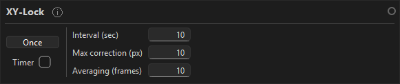

Use ``Once`` for a single correction. Use the timer option for repeated
automatic corrections. The interval, maximum correction, and averaging window
control how aggressively the ROI is moved.

Before enabling repeated XY-Lock, confirm:

* The selected bead ID is correct.
* The ROI is centered well enough for tracking.
* The correction size is conservative for your experiment.

Z-Lock
^^^^^^

Z-Lock controls a focus motor to keep one bead near a target Z value. It
requires a registered focus motor and a loaded Z-LUT.

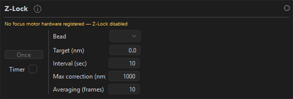

If Z-Lock appears unavailable, check that:

* A focus motor hardware manager is registered.
* A Z-LUT has been generated or loaded.
* The selected bead has valid Z tracking data.

See :doc:`connect_hardware` for hardware manager setup.

Practice With the Simulated Focus Motor
^^^^^^^^^^^^^^^^^^^^^^^^^^^^^^^^^^^^^^^

You can test the Z-LUT generation and Z-Lock workflow without real focus
hardware by launching the simulated focus motor example. From the repository
root on Windows, run:

.. code-block:: powershell

   python .\examples\focus\simulated_focus_motor.py

On Linux or macOS, use:

.. code-block:: bash

   python examples/focus/simulated_focus_motor.py

This example starts MagScope with the default simulated bead camera, registers
one ``SimulatedFocusMotor``, adds a ``Simulated Focus Motor`` control panel, and
adds a focus-position plot. The simulated focus motor uses the same
``FocusMotorBase`` interface that Z-LUT generation and Z-Lock expect. When it
moves, it also updates the simulated camera focus, so the workflow can be used
as a functional practice setup.

The added control panel lets you command a simulated target position and speed.

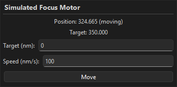

The added focus plot shows the simulated motor position and target over time.
In the example plot, the red trace is the current position and the green trace
is the commanded target.

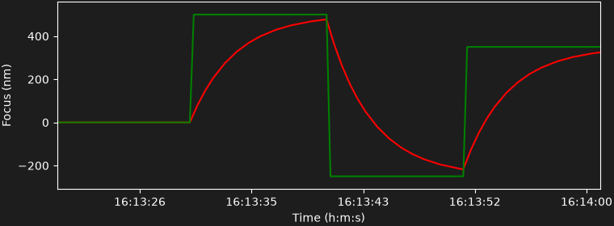

To generate a practice Z-LUT:

1. Add at least one bead ROI in the ``Live Camera`` view.
2. In ``Recording and Saving``, choose ``Track``, ``Track and Video (ROIs)``, or
   ``Track and Video (Full)`` as the data mode.
3. Keep ``Acquire`` enabled and wait until tracking is updating.
4. Open ``Z-LUT`` > ``New``.
5. Choose a sweep inside the simulated motor range, such as ``-500`` to
   ``500`` nm. Use a larger step and fewer measurements for a quick workflow
   check, or smaller steps and more measurements for a smoother practice LUT.
6. Let the sweep finish, select the generated bead result, and use
   ``Save and Load`` so the generated file becomes the active Z-LUT.

To try Z-Lock after that:

1. Confirm the generated Z-LUT is loaded.
2. Confirm tracking is still running and the bead used for Z-Lock has valid
   Z data.
3. In the ``Z-Lock`` panel, enter the bead ID, target Z value, interval, maximum
   correction, and averaging window.
4. Enable Z-Lock and watch the simulated focus motor plot. The target and
   position traces should respond as MagScope sends focus corrections.
5. Disable Z-Lock when you are finished testing the workflow.

The simulated focus motor is only a practice tool. A Z-LUT generated from the
simulated camera is useful for learning the buttons, dialogs, and required
state, but it is not a calibration for a real microscope.

Z-LUT Setup
^^^^^^^^^^^

A Z-LUT maps bead image profiles to focus positions. Generate or load one
before expecting Z-Lock to hold a focus target. The active Z-LUT is shared by
tracking and Z-Lock: tracking uses it to calculate bead Z positions, and
Z-Lock uses those Z positions to decide how to move the focus motor.

The top-bar ``Z-LUT`` menu contains four actions:

* ``New`` opens the setup dialog for generating a Z-LUT from the current
  focus motor, bead ROIs, and tracking settings.
* ``Load`` opens a ``.txt`` file picker and makes the selected Z-LUT active.
* ``Unload`` clears the active Z-LUT. It is disabled until a Z-LUT is loaded.
* ``Show Current`` opens a preview of the active Z-LUT. It is also disabled
  until a Z-LUT is loaded.

The ``Z-LUT`` panel in the controls area provides the same load/clear workflow
inside the normal panel layout. Use ``Select Z-LUT File`` to choose a ``.txt``
Z-LUT file. Use ``Clear Z-LUT`` to unload it. When a file is loaded, the panel
shows the path plus the detected minimum Z, maximum Z, average step size, and
profile length.

Generating a New Z-LUT
""""""""""""""""""""""

Before starting a new Z-LUT:

1. Add at least one bead ROI.
2. Choose a tracking data mode in ``Recording and Saving``: ``Track``,
   ``Track and Video (ROIs)``, or ``Track and Video (Full)``. Video-only
   modes do not produce the bead profiles needed for Z-LUT generation.
3. Confirm exactly one focus motor is registered. For practice, use
   ``examples/focus/simulated_focus_motor.py``. On a real microscope, use the
   hardware connection guide for the focus motor.
4. Wait until the selected bead is visible and tracking is updating.

Use ``Z-LUT`` > ``New`` to enter the sweep range and number of measurements
per step.

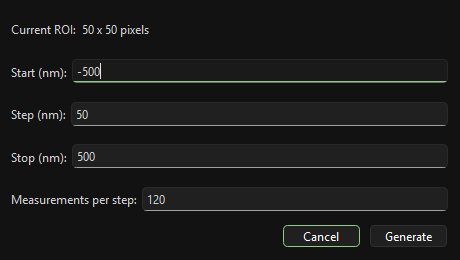

The setup values are in nanometers:

* ``Start`` is the first focus position.
* ``Step`` is the distance between focus positions. It cannot be zero, and its
  sign must point from ``Start`` toward ``Stop``.
* ``Stop`` is the final focus position. It must land exactly on the requested
  step grid.
* ``Measurements per step`` controls how many bead profiles are collected at
  each focus position. More measurements can make the resulting Z-LUT smoother
  but make the sweep slower.

The requested sweep must stay inside the focus motor limits. During the sweep,
MagScope moves the focus motor to each step, captures fresh tracked bead
profiles, and then builds one candidate Z-LUT per captured bead.

After a sweep completes, review the generated Z-LUT, choose the bead to use,
and save it. ``Save`` writes the selected bead's Z-LUT to disk. ``Save and
Load`` writes the same file and immediately makes it the active Z-LUT for the
session.

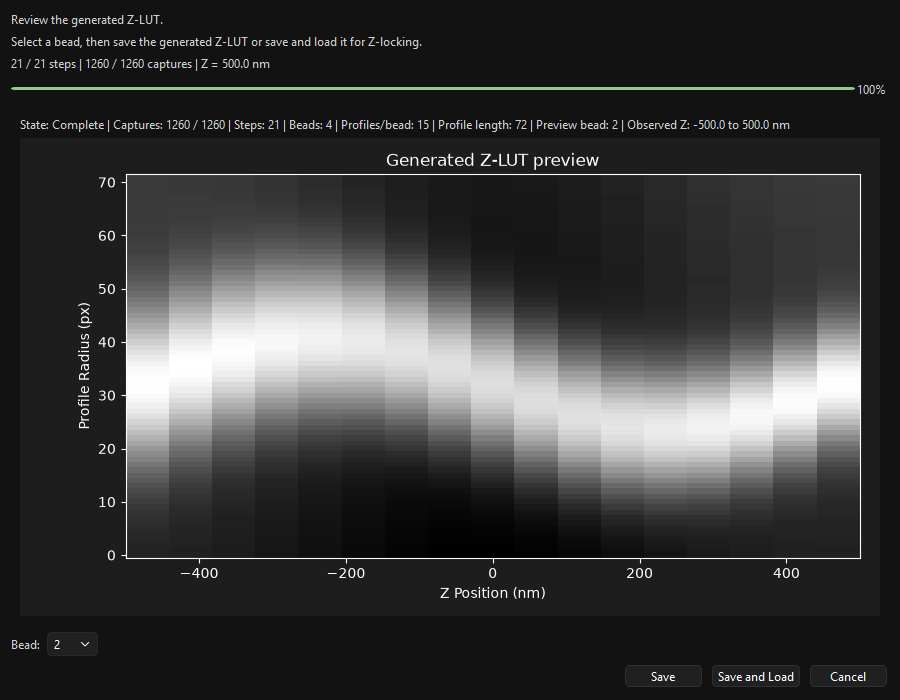

Z-LUT Text Files
""""""""""""""""

Generated files are standard text files. The save dialog suggests a name like
``generated_zlut_bead_<bead-id>.txt``, but you can choose another ``.txt`` name.
Each saved file contains one numeric matrix:

* The first row contains the Z reference positions in nanometers.
* Each remaining row contains one bead-profile sample across those Z positions.
* The file must have at least two Z positions and at least one profile row.
* The Z reference row must contain finite numeric values.

The number of profile rows is the profile length shown in the ``Z-LUT`` panel.
If you change ROI size or tracking/detection settings after generating a
Z-LUT, the loaded file may no longer match the current profiles. In that case
MagScope can warn that the Z-LUT may not match the current ROI or detection
settings. Reload a compatible file, restore the matching settings, or
regenerate the Z-LUT.

Loading, Showing, and Clearing
""""""""""""""""""""""""""""""

Use ``Z-LUT`` > ``Load`` when you want to activate an existing calibration
file. This is equivalent to using ``Select Z-LUT File`` in the ``Z-LUT`` panel.
After loading, Z tracking and Z-Lock use the active file, and ``Unload`` plus
``Show Current`` become available in the menu.

Use ``Z-LUT`` > ``Show Current`` to inspect the active file without changing
it. This is useful after importing a file from another session because it shows
the loaded path and a preview of the matrix. If the preview cannot be drawn,
the file may be malformed or not a valid Z-LUT text matrix.

Use ``Z-LUT`` > ``Unload`` or ``Clear Z-LUT`` when you want to stop using the
current Z-LUT. Clearing the Z-LUT does not delete the ``.txt`` file from disk;
it only removes it from the active MagScope session. Without an active Z-LUT,
tracking can still run, but Z values may be unavailable and Z-Lock cannot hold
a target focus position.

Why Generation May Be Blocked
"""""""""""""""""""""""""""""

If ``Z-LUT`` > ``New`` refuses to start, check these items first:

* At least one bead ROI must be selected.
* The application must have a usable video buffer, which normally means the
  main window has finished starting.
* The data mode must be ``Track``, ``Track and Video (ROIs)``, or
  ``Track and Video (Full)``.
* Exactly one ``FocusMotorBase`` hardware manager must be registered. No focus
  motor, or more than one focus motor, prevents generation.
* ``Measurements per step`` must be a positive integer.
* The sweep must contain at least two focus positions.
* The step cannot be zero, must point from start toward stop, and must land
  exactly on the stop position.
* The requested sweep range must fit within the focus motor limits.
* If another generation sweep is already running or waiting for review, cancel
  or finish that workflow before starting a new one.

If generation starts but fails during capture, make sure the bead stays visible
inside its ROI throughout the sweep and that tracking continues to produce
profiles at each focus position. Try a smaller sweep range or fewer beads when
testing the workflow for the first time.

Scripting
---------

The ``Scripting`` panel loads and runs Python scripts that automate MagScope.

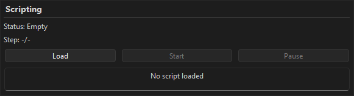

A typical scripting workflow is:

1. Write a Python script that creates a ``magscope.Script`` object.
2. Add script commands to it.
3. Use ``Load`` in the Scripting panel to choose the file.
4. Check that the panel reports the script as loaded.
5. Click ``Start``.
6. Use pause/resume controls if the script supports a long-running sequence.

Scripts are useful for repeated acquisition routines, motor moves, timed steps,
and long experiments with a defined sequence. See :doc:`scripting_guide` for the
full scripting workflow and :doc:`scripting_commands` for available commands.

Windows and Layout
------------------

MagScope opens one main window with dockable ``Live Camera`` and ``Live Plots``
panes. You can undock either pane and move it to another monitor, then dock it
again by dragging it back into the main window.

Viewer docks
^^^^^^^^^^^^

``Live Camera`` and ``Live Plots`` are viewer docks. They are controlled by the
top-bar ``Layout`` menu and by the dock buttons in the viewer title bars.

Use the ``Layout`` menu when a viewer pane is hidden, floating, or no longer
where you expect it:

* Show hidden viewer panes.
* Dock floating panes back into the main window.
* Reset the viewer layout.

``Dock All Windows`` brings the viewer panes back into the main window.
``Reset Viewer Layout`` restores the default camera/plots arrangement. These
commands affect the viewer docks, not the left-side workflow tabs.

Workflow tab layout
^^^^^^^^^^^^^^^^^^^

The left-side workflow area contains the ``Run``, ``Analysis``, ``Locking``,
and ``Motors`` tabs. This layout is separate from the ``Live Camera`` and
``Live Plots`` viewer docks.

If the workflow tabs or control panels are arranged in a confusing way, open
``Preferences`` and use the ``Appearance/Layout`` section. ``Reset Current
Section`` resets the appearance/layout settings without resetting all MagScope
and tracking preferences. ``Reset All`` is broader and should be saved for
cases where you want to rebuild the whole interface configuration from
defaults.

Which recovery option to use
^^^^^^^^^^^^^^^^^^^^^^^^^^^^

Use this order when the interface looks wrong:

1. If ``Live Camera`` or ``Live Plots`` is missing, use the ``Layout`` menu.
2. If a viewer is floating on another monitor, use ``Dock All Windows``.
3. If the viewer arrangement is confusing, use ``Reset Viewer Layout``.
4. If the left workflow tabs or control-panel layout is confusing, reset
   ``Preferences`` > ``Appearance/Layout``.
5. If imported preferences left the whole interface in a bad state, use
   ``Reset All`` as a last-resort cleanup.

Layout changes are useful during experiments with multiple monitors. If a pane
disappears, use the ``Layout`` menu before restarting MagScope.

Shutdown and Restart
--------------------

To shut down cleanly:

1. Turn off ``Saving`` if it is enabled.
2. Let any active script finish or stop it intentionally.
3. Disable repeated lock controls if they are active.
4. Close the MagScope window.
5. Wait for shutdown to finish before starting another session.

Shutdown can take a little while because manager processes need to stop cleanly.
You can also call :py:meth:`MagScope.stop <magscope.scope.MagScope.stop>` from
Python.

Do not call ``start()`` twice on the same ``MagScope`` object. Create a new
object if you need to restart from the same Python interpreter.

Troubleshooting
---------------

The GUI does not open
^^^^^^^^^^^^^^^^^^^^^

Confirm you are using the Python environment where MagScope is installed. If you
are following the demo workflow, run the short launch snippet from this guide in
a fresh Python interpreter.

The live camera is blank or frozen
^^^^^^^^^^^^^^^^^^^^^^^^^^^^^^^^^^

Check that the camera is connected and that the main window is still responsive.
In the demo, restart MagScope from a fresh Python session if the simulated feed
does not begin. With real hardware, check the camera adapter and connection
guide.

ROIs are missing or wrong
^^^^^^^^^^^^^^^^^^^^^^^^^

Confirm the ROI count in the Live Camera toolbar. If the wrong bead is selected,
click the intended ROI or enter its ID in ``Selected Bead (red)``. If the ROI
box is off center, drag it or remove it and add it again.

Live plots stay blank
^^^^^^^^^^^^^^^^^^^^^

Wait up to about 30 seconds for processing to populate the plot buffer. Then
check that ``Acquire`` is enabled, at least one ROI exists, and the selected
bead ID exists. If a reference bead is set, confirm that reference bead ID also
exists.

Saving is enabled but files are not appearing
^^^^^^^^^^^^^^^^^^^^^^^^^^^^^^^^^^^^^^^^^^^^^

Confirm that ``Saving`` is checked, ``Folder`` points to a real writable
location, and the selected ``Data`` mode matches what you expect to save. If you
changed the folder while saving was active, disable saving, choose the folder
again, then re-enable saving.

The video buffer fills repeatedly
^^^^^^^^^^^^^^^^^^^^^^^^^^^^^^^^^

Reduce the amount of work MagScope needs to do. Common fixes are:

* Track fewer beads.
* Save tracks instead of video.
* Avoid full-frame video unless needed.
* Disable live diagnostic panels you do not need.
* Review video buffer and processor settings in Preferences.

Lock controls are unavailable
^^^^^^^^^^^^^^^^^^^^^^^^^^^^^

XY-Lock requires bead ROIs and valid tracking. Z-Lock also requires a registered
focus motor and a Z-LUT. Use the hardware connection guide before expecting
Z-Lock to operate on a real instrument.

Auto Bead Selection is disabled or does nothing
^^^^^^^^^^^^^^^^^^^^^^^^^^^^^^^^^^^^^^^^^^^^^^^

Auto Bead Selection needs an active live camera view, a recent image, available
ROI capacity, and no other Auto Bead Selection dialog already open. If the menu
item is disabled or selecting it does nothing:

* Wait until the live camera has drawn at least one frame.
* Make sure the ``Live Camera`` viewer is visible.
* Finish or close any existing Auto Bead Selection dialog.
* Finish any pending manual bead-add action.
* Remove unused ROIs if the bead list is already full.

If the dialog opens but does not add beads, the proposed ROIs may overlap
existing ROIs or exceed the available bead capacity.

Preferences reject a value
^^^^^^^^^^^^^^^^^^^^^^^^^^

Preference fields validate types and allowed ranges. If a value is rejected,
use the message in the dialog to choose a valid value. Common fixes are to use
plain numbers instead of units, avoid negative values for counts and sizes, and
keep ROI and buffer settings within practical ranges.

Use ``Reset Current Section`` when only one preference group is confusing. Use
``Reset All`` when you want to return MagScope, tracking, appearance, and layout
preferences to defaults.

A script fails or stops early
^^^^^^^^^^^^^^^^^^^^^^^^^^^^^

Check that the script file was loaded from the expected path and that the
Scripting panel reports it as loaded before pressing ``Start``. If a script
stops early, review the script for invalid command names, missing arguments,
hardware commands that require unavailable devices, or timing assumptions that
do not match the current experiment.

If a script moves hardware or controls locks, test the same steps manually
first. See :doc:`scripting_guide` and :doc:`scripting_commands` for the expected
script structure and command list.

Search has no useful results
^^^^^^^^^^^^^^^^^^^^^^^^^^^^

Search is a navigation aid. It shows where controls are; it does not run
actions. If the search dropdown has no useful results:

* Try a shorter term, such as ``ROI`` instead of a full sentence.
* Try the visible label on the button, field, menu, or panel.
* Try a related term, such as ``reference``, ``relative time``, ``dock``, or
  ``Z-LUT``.
* Open the likely workflow tab first if the control is inside a collapsed
  panel.

Settings import or export fails
^^^^^^^^^^^^^^^^^^^^^^^^^^^^^^^

Preference import/export uses YAML files. If import fails, confirm the file is
a MagScope preferences export and has not been edited into an invalid format.
If export fails, choose a writable folder and filename.

Imported preferences can include appearance and layout state. If an imported
layout hides panes or leaves the interface awkward, use ``Layout`` > ``Reset
Viewer Layout`` for viewer docks or ``Preferences`` > ``Appearance/Layout`` >
``Reset Current Section`` for the workflow/control layout.

Z-LUT or profile mismatch warnings appear
^^^^^^^^^^^^^^^^^^^^^^^^^^^^^^^^^^^^^^^^^

Z-LUTs depend on the bead profiles, ROI size, tracking settings, and focus
motor sweep used when they were created. If MagScope warns that a Z-LUT or
profile does not match the current setup, do not assume Z-Lock will be valid.

Common fixes are:

* Reload the Z-LUT that belongs to the current experiment.
* Restore the ROI and tracking settings used to create the Z-LUT.
* Regenerate the Z-LUT after changing ROI size, profile length, tracking mode,
  bead selection, or focus-motor setup.
* Practice the workflow with the simulated focus motor before using real
  hardware.
